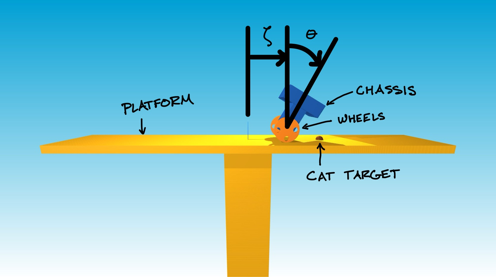

# Design Project 1 (wheeled cat-catching robot)
{: .no_toc }

- TOC
{:toc }

## System

The first project that you will complete this semester is to design, implement, and test a controller that enables a wheeled robot to balance upright and to catch test-pilots (cats) who have been hired to evaluate a prototype launch system.



The robot consists of a *chassis* (dark blue) and of *wheels* (orange). This sort of robot is often called "differential-drive" because two separate motors allow a different torque to be applied by the chassis to the left wheel and the right wheel, and so allow the robot to turn one way or the other.

A differential-drive transmission is a common design choice for mobile robots. For example, NASA used it in a prototype of [Robonaut](https://robonaut.jsc.nasa.gov/R1/sub/mobility.asp). You can read more about the reasons why in the textbook [Introduction to Autonomous Mobile Robots, Second Edition (Siegward, Nourbakhsh, and Scaramuzza, 2011)](https://mitpress.mit.edu/books/introduction-autonomous-mobile-robots-second-edition), also [available online](https://ieeexplore.ieee.org/book/6267528) (for free from the [library at Illinois](https://ieeexplore-ieee-org.proxy2.library.illinois.edu/servlet/opac?bknumber=6267528) and at other academic institutions). The two-wheeled, differential-drive design has also been popularized by consumer products like the [Segway Ninebot S2](https://www.segway.com/ninebot-s2/) or the [Segway RMP](https://www.segway.com/robotics/commercial/rmp220/).

In this project, you will focus only on motion forward and backward and will assume that the same torque is applied to both wheels.

The launch system uses a catapult to throw pilots at high velocity from the ground to an elevated platform (yellow). This launch system is designed so that the pilots follow a parabolic trajectory to arrive at a much lower velocity just above the platform. This low velocity is chosen so that pilots will be safe if they are caught (and held without dropping) in the basket carried on top of the robot.

This launch system is unable to make each pilot land at the same place on the platform, unfortunately. However, it is able to quickly and accurately predict the *target* (red sphere) where each pilot will land, shortly after launch.

Cats have been hired as pilots to test this launch system. They understand the risk and are eager to fly. Your job is to keep them safe.


## Model

If we assume that the wheels roll without slipping on the surface of the platform, then the motion of the robot is governed by ordinary differential equations with the form

$$ M(q) \ddot{q} + N(q, \dot{q}) = F(q) r $$

where

$$
\begin{gather*}
M(q) = \left[\begin{matrix}(J_{w} / r_{w}^{2}) + m_{b} + m_{w} & m_{b} r_{b} \cos{\left(\theta \right)}\\m_{b} r_{b} \cos{\left(\theta \right)} & J_{b} + m_{b} r_{b}^{2}\end{matrix}\right] \\
N(q, \dot{q}) = \left[\begin{matrix}- m_{b} r_{b} \sin{\left(\theta \right)} \dot{\theta}^{2}\\- g m_{b} r_{b} \sin{\left(\theta \right)}\end{matrix}\right] \\
F(q) = \left[\begin{matrix}1 / r_{w}\\-1\end{matrix}\right]
\end{gather*}
$$

and

$$
q = \begin{bmatrix} \zeta \\ \theta \end{bmatrix}
\qquad\qquad
r = \begin{bmatrix} \tau \end{bmatrix}.
$$

The variables in these equations are defined as follows:

* $\zeta$ is the **wheel position** ($\text{m}$);
* $\dot{\zeta}$ is the **wheel velocity** ($\text{m}/\text{s}$);
* $\theta$ is the **pitch angle** ($\text{rad}$) --- positive means tilting forward;
* $\dot{\theta}$ is the **pitch rate** ($\text{rad}/\text{s}$);
* $\tau$ is the **wheel torque** ($\text{N}\cdot\text{m}$) applied by the chassis to the wheels --- positive will cause the wheels to rotate forward.

The constant parameters in these equations are defined as follows:

$$ \begin{align*}r_w &= 0.325 \\ m_w &= 2.4 \\ J_w &= 0.12675 \\ r_b &= 0.3 \\ m_b &= 12.0 \\ J_b &= 0.8 \\ g &= 9.81. \end{align*} $$

Sensors provide measurements of the wheel position, wheel velocity, pitch angle, and pitch rate, as well as of the position that the launched cat-pilot is expected to land, i.e., the **cat target** ($\text{m}$), which varies up to a maximum of $\pm 2.5\;\text{m}$ from the center of the platform. Actuators allow you to choose what torque will be applied to the wheels, up to a maximum of $\pm 5\;\text{N}\cdot\text{m}$.

The code provided here simulates the motion of this system: `CatbotDemo-Template.ipynb`. The equations of motion are derived in symbolic form here: `DeriveEOM-Template.ipynb`.

## Tasks

Please do the following things:

* Choose a wheel position that you want to achieve.
* Linearize the model about an equilibrium point that corresponds to this wheel position and express the result in state-space form.
* Design a linear state feedback controller and verify that the closed-loop system is asymptotically stable in theory. Note that here you verify the asymptotic stability with your controller on the **linearized model** of the system.
* Implement this controller and verify that the closed-loop system is asymptotically stable in simulation, at least when initial conditions are close to equilibrium.
* Test the resulting launch system in simulation and verify that the robot (with your controller) is capable of catching pilots with high probability.

In doing these things, **keep your focus on the safety of your pilots**.

Would you feel comfortable asking a cat-pilot to test your launch system based on evidence from only one simulation (starting from only one set of initial conditions) that your controller "works"?

Would you feel comfortable asking other cats --- those who are not test-pilots --- to use your launch system based on the success of only a single launch?

Think carefully about what results would support a comprehensive argument for the safety of your launch system and --- since no launch system is 100% reliable --- try hard to identify the conditions under which failures are likely to occur.


### Your deliverables

We will use Canvas for submitting design projects. You must submit the following by **February 15, 11:59pm**:

##### Code

Your code will satisfy the following requirements:

- It **must** be in a folder called code-<net-id> (lower case).
- It **must** include a notebook called `GenerateResults.ipynb` that can reproduce all of the results that you show in the report. (You can work in the CatbotDemo-Template.ipynb notebook (or the copy that you created) and then rename it to `GenerateResults.ipynb` when you are ready to submit.)
- It **must** include all the other files (with the right folder structure) that are necessary for `GenerateResults.ipynb` to function.
- It **must not** rely on any dependencies other than those associated with the conda environment.

##### Report

This report will satisfy the following requirements:

- It must be a single PDF document that is called `report.pdf` and that conforms to the guidelines for [Preparation of Papers for AIAA Technical Conferences](https://www.overleaf.com/latex/templates/latex-template-for-the-preparation-of-papers-for-aiaa-technical-conferences/rsssbwthkptn#.WbgUXMiGNPZ). In particular, you **must** use the above given LaTeX manuscript template.
- It must have a descriptive title, name of the author, an abstract, and a list of nomenclature.
- It must say how you addressed all of the required tasks (see above).
- It must tell a story that shows you have found and explored something that interests you.
- It must acknowledge and cite any sources (including the use of Generative tools).
- It should preferably be about 5 pages in length — it will be hard to show off your work with anything shorter, and it will be hard to keep readers’ attention with anything longer.
  You may never have used LaTeX before. Don't be afraid! Help will be provided, and you will learn a lot. You will submit the PDF document produced using LaTeX. In particular, we recommend using [Overleaf](https://www.overleaf.com/), an easy to use web-based LaTeX editor.

You may organize your report however you like, but a natural structure might be to have sections titled Introduction, Model, Design, Results, and Conclusion.

#### Submission Instructions

To make it easier logistically, there will be **three** assigned submissions for this project on Canvas. Please submit the following separately:

1. Report: Submit a pdf version of your report.
2. Video: Every time you run your code, you will see that it also creates a `video.mp4`, which shows a simulation of your controller in action. Please submit this video file (make sure the video corresponds to the final controller you are creating).
3. Code: Compress your code into a zip file and submit the zip file named code-<net-id>.zip
Before compressing your files into a compressed zip file for submission, the project folder should look like this:

```
├── __pycache__
│   └── ae353_catbot.cpython-314.pyc # you might not see this, that is okay
├── ae353_catbot.py # necessary
├── CatbotDemo-Template.ipynb # optional, this is the template file we provide, feel free to delete it or rename it to GenerateResults.ipynb
├── GenerateResults.ipynb  # necessary, this is where you will implement your controller. 
├── DeriveEOM-Template.ipynb # optional, this is the EOM derivation file we provide, feel free to delete it
└── urdf # necessary
    ├── cat-pilot.stl
    ├── cat-pilot.urdf
    ├── catbot.urdf
    ├── cube.stl
    ├── meow.wav
    ├── platform.stl
    ├── platform.urdf
    └── wheel.stl

```

### Evaluation

Your work will be evaluated based on:

- (60%) Completion of the requirements and the resulting description of the results
- (20%) Submission of working code
- (5%) Your demonstration video
- (15%) Your report being formatted correctly

Late submission will be penalized (by up to 25% for the first week of delay—**prorated** for the actual amount of delay—and 50% after then), but extraordinary efforts may receive extra commendation. The focus of our evaluation of your report this time (as you learn how to use LaTeX) will be on content—we will not look at style, grammar, or any other aspect of your presentation, as long as there is no barrier to understanding your work.

### Frequently asked questions

##### How do I get started?

The first thing you should do is update your local copy of the repository with the DP1 file, to do this, please follow the [installation instructions](https://uiuc-ae353.github.io/setup/), very specifically, follow the 'Do these things every day before you start your work' section and run the command after navigating to the directory where you have cloned the repository:

```
conda activate ae353
git pull
```

This will update your local copy of the repository with the code for DP1.

Next, open the `CatbotDemo-Template.ipynb` notebook and run all of the cells to see how the simulation works. You can play around with some of the parameters in the simulation to see how they affect the behavior of the system.

After that, if you have read the entire project description and are not sure how to proceed, then take your best guess and ask a question on Canvas or attend in-person discussion sessions dedicated for design projects. Improving your ability to get unstuck by asking a good question is an explicit goal of this course.
