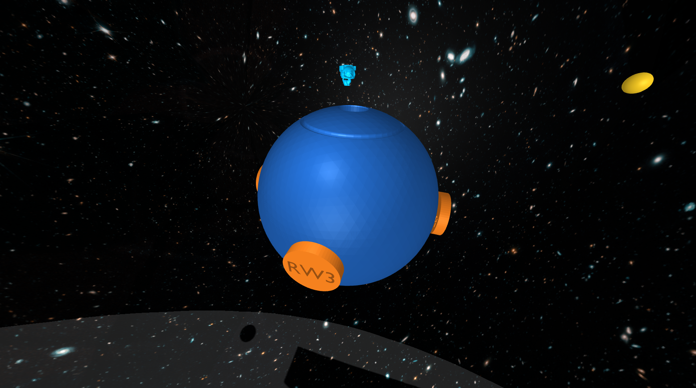
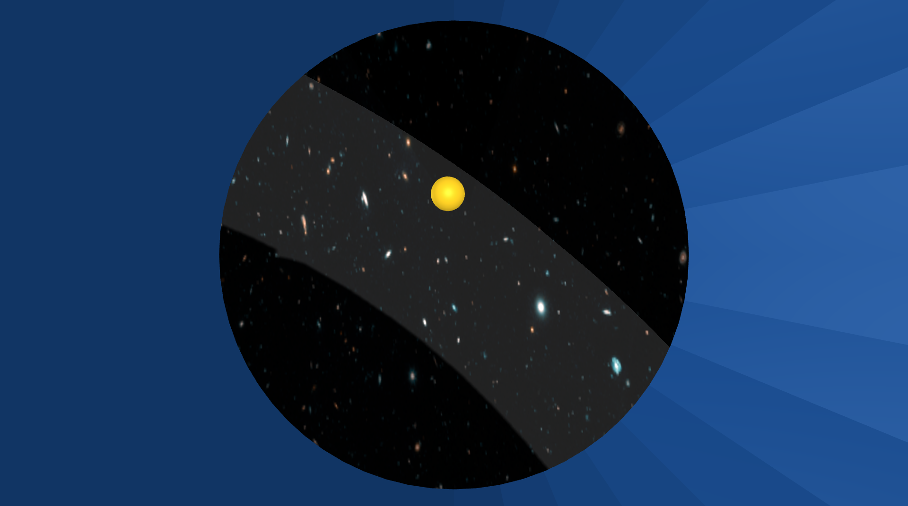
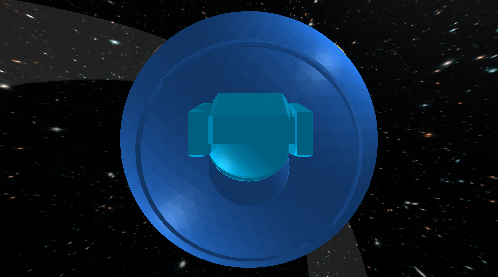

# Design Project 2 (spacecraft with star tracker)
{: .no_toc }

- TOC
{:toc }

## System

The third project that you will complete this semester is to design, implement, and test a controller that enables a spacecraft to maintain a fixed orientation so that an astronaut (i.e., a space cat) can safely dock and re-enter the spacecraft through a hatch.

---


The spacecraft.

---


The view from the star tracker.

---


The space-cat waiting to dock through the hatch.

---

This spacecraft (dark blue) has four reaction wheels (orange). It is up to you to decide where these reaction wheels are located — the picture shows one among many possibilities. These reaction wheels are momentum exchange devices — when a torque is applied to a wheel, an equal and opposite torque is applied to the spacecraft. It is these reaction wheels that will allow your controller to keep the spacecraft pointing in the right direction.

This spacecraft also has a star tracker. This star tracker is a camera that measures the position in an image of each star (yellow) in its field of view. These measured positions, while not perfect, can be compared to where stars *should* be in order to estimate the orientation and angular velocity of the spacecraft. It is up to you to decide which stars to track — that is, to decide both how many stars to track and also where these stars *should* be located in the field of view of the star tracker.

Beware! Flying debris (red) may collide with your spacecraft and cause sudden disturbances.

An astronaut (light blue), who has been conducting operations outside the spacecraft, is almost out of air and so is on their way back to dock and re-enter through a small hatch. Unfortunately, this astronaut is also completely out of fuel, and so is unable to change either their speed or direction of motion. For this reason, it is absolutely critical that the spacecraft maintain a fixed orientation (despite the flying debris) — otherwise, the astronaut will miss the hatch and a brave cat will have been lost.

Bring your astronaut home!

## Context {#spacecraft-context}

[Celestial navigation](https://education.nationalgeographic.org/resource/navigation/) — "using stars, moon, sun, and horizon to calculate position" (or simply the time of day) — dates back thousands of years.

[Star trackers](https://en.wikipedia.org/wiki/Star_tracker) — like those from [Ball](https://www.ball.com/aerospace/capabilities/technologies-components/star-trackers), [Terma](https://www.terma.com/products/space/star-trackers/), or [Rocket Lab](https://www.rocketlabusa.com/space-systems/satellite-components/star-trackers/), for example — take this same concept into space. One key difference is that while celestial navigation on Earth has been used primarily to determine position (i.e., latitude and longitude), star trackers in space are used primarily to determine orientation or "spacecraft attitude."

The way this works is that star trackers compare the location of stars in an image to a pre-surveyed catalog of stars. In particular, this catalog allows a star tracker to predict the pattern of stars that will be seen in an image as a function of spacecraft orientation. The star tracker searches for the orientation — e.g., for the yaw, pitch, and roll angles — that would make the predicted pattern best match the observed pattern.

Doing this from scratch without a good initial guess is a challenge, and can be slow. *Updating* an *existing* estimate of orientation, however, can be done quickly and used for fine guidance. This is what you will do in your own project.

Some of the small satellites that are designed, built, and launched by the Laboratory for Advanced Space Systems at Illinois (LASSI) use star trackers as a critical part of their GNC subsystems. See their [description of facilities](https://aerospace.illinois.edu/research/research-facilities/laboratory-advanced-space-systems-illinois-lassi) and [ research website](https://lassiaero.web.illinois.edu) for more information.

You can read more about star trackers and their use for spacecraft attitude determination — as well as more about reaction wheels and their use for spacecraft attitude control — in [Fundamentals of Spacecraft Attitude Determination and Control (Markley and Crassidis, 2014)](https://link.springer.com/book/10.1007/978-1-4939-0802-8).


## Model

The rotational motion of the spacecraft is governed by ordinary differential equations with the following form:

$$\begin{bmatrix} \dot{\psi} \\ \dot{\theta} \\ \dot{\phi} \\ \dot{w_x} \\ \dot{w_y} \\ \dot{w_z} \end{bmatrix} = f\left(\psi, \theta, \phi, w_x, w_y, w_z, \tau_1, \tau_2, \tau_3, \tau_4\right).$$

Here are the variables in these equations:

* $\psi$ is the **yaw angle** (rad)
* $\theta$ is the **pitch angle** (rad)
* $\phi$ is the **roll angle** (rad)
* $w_x$ is the **angular velocity about the body-fixed $x$ axis** (rad/s), which points forward
* $w_y$ is the **angular velocity about the body-fixed $y$ axis** (rad/s), which points left
* $w_z$ is the **angular velocity about the body-fixed $z$ axis** (rad/s), which points up
* $\tau_1$ is the **torque applied to wheel 1** by a motor on the spacecraft ($N\cdot\text{m}$)
* $\tau_2$ is the **torque applied to wheel 2** by a motor on the spacecraft ($N\cdot\text{m}$)
* $\tau_3$ is the **torque applied to wheel 3** by a motor on the spacecraft ($N\cdot\text{m}$)
* $\tau_4$ is the **torque applied to wheel 4** by a motor on the spacecraft ($N\cdot\text{m}$).

{: .warning}
> The body frame attached to the spacecraft has $x$ forward, $y$ **left**, and $z$ **up**. This convention is different from what is commonly used for aircraft (with $y$ right and $z$ down). A positive yaw angle means the spacecraft rotates **left** (not right, like the aircraft). A positive pitch angle means the spacecraft rotates **down** (not up, like the aircraft).

The maximum torque that can be applied by each motor is $\pm 2\;\text{N}\cdot\text{m}$.

A [symbolic description of these equations of motion](https://github.com/uiuc-ae353/ae353-sp26/blob/main/02_spacecraft/DeriveEOM-Template.ipynb) is provided with the [project code](https://github.com/uiuc-ae353/ae353-sp26/tree/main/02_spacecraft).

{: .note-title}
> You must choose the placement of reaction wheels
>
> **The dynamic model depends on where the reaction wheels are placed.** The [same notebook that derives the equations of motion](https://github.com/uiuc-ae353/ae353-sp26/blob/main/02_spacecraft/DeriveEOM-Template.ipynb) also allows you to choose (and visualize) this placement. You **must** run the code in this notebook **before** you run the simulator, since it creates the file (`spacecraft.urdf` in the `urdf` directory) that has a model of the spacecraft with **your** choice of reaction wheel locations.

The sensor is a star tracker. It measures the position (in an image) of each star in its field of view. This measurement has the following form **for each star**:

$$\begin{bmatrix} y_\text{star} \\ z_\text{star} \end{bmatrix} = g(\psi, \theta, \phi, \alpha, \delta).$$

You will already recognize the yaw, pitch, and roll angles in this equation. The other variables are as follows:

* $\alpha$ is the **right ascension** (rad) of the star
* $\delta$ is the **declination** (rad) of the star.

Again, a [symbolic description of this equation]({{ site.github.repository_url }}/tree/main/projects/03_spacecraft/DeriveEOM-Template.ipynb) is provided with the [project code]({{ site.github.repository_url }}/tree/main/projects/03_spacecraft).


{: .warning}
> You will notice a new word in this project: "observer"/"observability". We will discuss this in a lot more detail over the next few lectures. But in short, an observer is a system that estimates the internal state of a dynamic system using a mathematical model and measured outputs. It reconstructs states that may not be directly measurable and often filters measurement noise to produce a more accurate state estimate. You need not worry about this in terms of "code" yet, we have implemented it for you in the [observer_provided.py](https://github.com/uiuc-ae353/ae353-sp26/blob/main/02_spacecraft/observer_provided.py) file. All you need to do is use the "estimates" from the observer to complete the task.


The code provided [here](https://github.com/uiuc-ae353/ae353-sp26/tree/main/02_spacecraft) simulates the motion of this system ([SpacecraftDemo](https://github.com/uiuc-ae353/ae353-sp26/blob/main/02_spacecraft/SpacecraftDemo-Template.ipynb)) and also derives both the equations of motion in symbolic form ([DeriveEOM](https://github.com/uiuc-ae353/ae353-sp26/blob/main/02_spacecraft/DeriveEOM-Template.ipynb)).

The simulator will quit and the spacecraft mission will be declared over when one of two conditions are met:

* Any star leaves the star tracker's field of view.
* Any reaction wheel has angular velocity that exceeds $\pm 50\;\text{rad}/\text{s}$.

The goal is to avoid these two conditions and to keep the spacecraft close to zero yaw, pitch, and roll for at least as long as it takes the astronaut to dock and re-enter (sixty seconds), despite noisy sensor measuremens and space debris.

## Tasks
In this project, we would like you to be more specific about what you mean by "success" and to provide quantitative evidence supporting the claim that you have (or have not) succeeded. People often think about this in terms of **requirements** and **verifications**.

#### What is a requirement?

A **requirement** is a property that the system you are designing must have in order to solve your problem (i.e., a thing that needs to get done). A good requirement is quantifiable---it involves a number that must be within a certain range in order to solve your design problem. A good requirement is also both relevant (it _must_ be satisfied---it is not optional) and detailed (it can be read and understood by anyone). 

Below follows a brief, and incomplete, list of guidlines followed by most engineers while writing requirements:

1. **Shall formatting:**
   Requirements shall be in "shall" format. A requirement should use the language: "ITEM A shall TASK A". This language minimizes ambiguity.

2. **Compound requirements:**
   Requirements should not have and conjunctions or transitions in them. For example, try to avoid "and", "but", "or", "further", "also:, etc. If you use these words, often you are defining two separate requirements.

3. **Ambiguous requirements:**
   Requirements shall be simple sentences that minimize ambiguity. You should not include time constraints without stating the point from which timing begins. You should not include maximum limits without defining the equilibrium conditions. You should not use ambiguous language that you do not FIRST (before the requirements and verifications) define.

4. **Requirements without initial conditions:**
   It is insufficient to say “The absolute value of MEASURE A shall not exceed CONSTRAINT A.” when you are talking about a measure that changes with time, depends on initial conditions, and varies with user inputs. For example, what if MEASURE A is the pitch of an aircraft and CONSTRAINT A is 5 degrees. The absolute value of the pitch angle shall not exceed 5 degrees. To satisfy this requirement, you must design a system that is not capable of producing pitch angles that exceed 5 degrees. Whereas this may be what an engineer wants, often it is not. Instead, consider the requirement “Given an initial condition of CONDITION A and user input of INPUT A, the absolute value of MEASURE A shall not exceed CONSTRAINT A.”

5. **Unverifiable requirements:**
   Requirements must be verifiable. This means that you must be able to prove that they are exactly met or not. For example, the requirement “The MEASURE shall be less than CONSTRAINT A after CONSTRAINT B seconds from initialization for all initial conditions between CONDITION A and CONDITION B.“ is not verifiable in simulation. This is because there are uncountably infinite initial conditions between CONDITION A and CONDITION B. To verify this requirement in simulation, one would have to run infinite simulations. Consider this instead, “The MEASURE shall be less than CONSTRAINT A after CONSTRAINT B seconds from initialization for initial condition CONDITION A.”, “The MEASURE shall be less than CONSTRAINT A after CONSTRAINT B seconds from initialization for initial condition CONDITION B.”,”, “The MEASURE shall be less than CONSTRAINT A after CONSTRAINT B seconds from initialization for initial condition CONDITION C.”,”. This set of requirements is verifiable in simulation because there are only a finite number of initial conditions that must be simulated.

6. **Plus and minus:**
   Engineers are often tempted to use the ± symbol in requirements and verifications. Often, this is a mistake. The requirement “MEASURE A shall remain within the limits ± CONTRAINT A” can be ambiguous. Are you defining a connected range or a disconnected range? Language such as “The absolute magnitude of MEASURE A shall not exceed CONSTRAINT A” is less ambiguous. Here it is clear that you are using a connected range.

7. **Requirements that constraint design:**
   Requirements should never constrain the design of a system. For example, if a system needs to allow astronauts to enter it and to exit it in space "The system shall include an airlock" is an insufficient requirement. This is because this requirement enforces that the system uses an airlock. Instead, consider "The system shall support egress of humans in space". "The system shall support ingress of humans in space". These requirements do not constrain the design of the system at all.

8. **Requirements of a requirement:**
   A requirement of a requirement should not be used. For example, you should not say "Our requirements must be sufficient to enforce TASK A.". Instead, list goals and accompanying requirements. For example, "The goal of the project is to ITEM A. Therefore, the system shall TASK A subject to CONSTRAINTS A".

#### What is a verification?

A **verification** is a test that you will perform to make sure that the system you are designing meets a given requirement. A good verification is based on a measurement---it checks that a quantity is in the range specified by the requirement. A good verification also has a set of instructions for how to make the measurement (an experimental protocol) and for how to interpret the results (methods of data analysis and visualization that provide evidence the requirement has been met). Consider the requirement given above (which, as we have said, still needs improvement):

> The wheel center shall remain within $$\pm 0.1~\text{meters}$$ of the ring centerline.

Here is a verification of this requirement that most engineers would consider unacceptable:

> The system will be tested in simulation.

This verification is not based on a measurement. Here is a better version that _is_ based on a measurement:

> The error between the wheel center and the ring centerline will be found in simulation.

This verification does not include a set of instructions for how to make the measurement or for how to interpret the results. Here is a better version that _does_ include a set of instructions:

> PyBullet will be be used to simulate the robot. The data generated by this simulation will be imported into a Jupyter Notebook for analysis with Python. The lateral error will be found at each time step. The maximum absolute value of lateral error over all time steps will be reported. If this maximum value is less than $$0.1~\text{meters}$$, the requirement is met.

Most engineers would argue that this verification still needs improvement. For example, does the simulation generate the same results every time, or is there variation? Just as you saw on your first design project, it seems reasonable to suspect that different initial conditions will produce different results. A reasonable engineer, then, would question whether or not the results of only _one_ simulation would really show that the requirement is met. Many verifications also provide more than just a single number as evidence---for example, they might produce a figure (e.g., a plot of error as a function of time) or some other type of visualization. Your task is to define _one_ verification for your requirement that has a measurement and a set of instructions for how to make the measurement and how to interpret the results.

Below follows a brief, and incomplete, list of guidelines followed by most engineers while writing verifications:

1. **Types of verifications:**
   There are four fundamental ways to verify a requirement. This is by inspection, demonstration, test, and analysis. In this order, each verification method increases in rigor.

2. **Verification by inspection:**
   Verification by inspection relies on visual, auditory, olfactory, tactile, taste observations from humans. Suppose the requirement is: “The system shall be red”. An example of verification by inspection is as follows: “REQUIREMENT A is verified by inspection. A randomized group of 15 volunteers will be asked to observe the system. They will be asked ‘What color is this system’, and their responses will be recorded. REQUIREMENT A is verified if and only if the majority of the volunteers’ responses include the keyword ‘red’”.

3. **Verification by demonstration:**
   Verification by demonstration is the manipulation of the system as intended in use to verify the results satisfy the parent requirements. Suppose the requirement is: “The system shall move box 32-DCA from location 16-B and place it in location 17-B”. An example of verification by demonstration is as follows: “REQUIREMENT A is verified by demonstration. Box 32-DCA is placed in location 16-B. The system is placed 0.5 meters away radially from box 32-DCA on a shared level surface. The system is initiated. REQUIREMENT A is verified if and only if box 32-DCA is in location 17-B upon system termination.”

4. **Verification by test (often called verification by simulation):**
   Verification by test is the process by which the system is subjected to a finite number of tests. A test is defined as a predetermined time series of initial conditions, user inputs, system conditions, etc. Suppose the requirement is: “The absolute magnitude of the system’s speed shall not exceed 0.5m/s”. An example of verification by test is as follows: “REQUIREMENT A is verified by test. The system is initialized in CONDITION A. Virtual user inputs are scheduled as INPUTS A. The system is engaged. After 10 seconds, the system is disengaged. The speed of the system is recorded via doppler radar every 0.25 seconds from engage to disengage. The maximum speed recorded by the doppler radar is recorded as MAXIMUM A. The system is initialized in CONDITION B. Virtual user inputs are scheduled as INPUTS B. The system is engaged. After 10 seconds, the system is disengaged. The speed of the system is recorded via doppler radar every 0.25 seconds from engage to disengage. The maximum speed recorded by the doppler radar is recorded as MAXIMUM B. REQUIREMENT A is verified if and only if MAXIMUM A is less than or equal to 0.5m/s and MAXIMUM B is less than or equal to 0.5m/s.”

5. **Verification by analysis:**
   Verification by analysis is the process by which a system is analyzed via models and calculations. This varies from verification by test because no specific experiments are conducted. Suppose the requirement is: “The absolute magnitude of the system’s speed shall not exceed 0.5m/s”. An example of verification by analysis is as follows: “REQUIREMENT A is verified by analysis. The equations of motion of the system are derived via Lagrangian mechanics. The time solution of the system’s speed is solved via the method of undetermined coefficients. The maximum of the time solution of the system’s speed as a function of the initial conditions and user inputs is determined via the Karush-Kuhn-Tucker theorem. REQUIREMENT A is verified if and only if the global maximum of the time solution of the system’s speed is less than or equal to 0.5m/s for all admissible initial conditions and user inputs.”

6. **Required information in verifications:**
   Just like the “Experimental Methods” section of a journal style paper, verifications should describe the steps that will be performed in enough detail that they could be understood and repeated exactly by a colleague with no exposure to this class or this design project. For example, it is insufficient to say “REQUIREMENT A will be verified via simulation”

7. **Negative form of verification:**
   Verifications must not be written in negative form, i.e., "... if MEASURE A exceeds CONSTRAINT B, then the requirement is not verified.". In general, verifications are written in the positive form, i.e., "... if the MEASURE A is less than the CONSTRAINT B, then the requirement is verified."

8. **Errors regarding data collection in verifications:**
   When a verification uses data collection, there must be no ambiguity surround these data. You must explicitly state which data are collected, when the collection starts, at which frequency the data is collected, which tool is used to generate the data, and exactly how the data is analyzed. It is insufficient to say “REQUIREMENT A is verified by running a simulation and collecting the data that it gives. If the MEASURE A does not exceed CONSTRAINT A, the requirement is verified.” Instead, consider, “REQUIREMENT A is verified by running an instance of the PyBullet simulation provided at SOURCE A subject to INITIAL CONDITION A. MEASURE A, MEASURE B, and MEASURE C are output from the simulation at a frequency of FREQUENCY A. These data are gathered for a duration of LEGNTH A seconds. When LENGTH A seconds have elapsed, these data are analyzed by METHOD A. REQUIREMENT A is verified if, and only if, METHOD A of MEASURE A, MEASURE B, and MEASURE C proves that MEASURE A does not exceed CONSTRAINT A.”

9. **Ambiguous data description in verification:**
   Engineers must avoid ambiguity when discussing data analysis. This is especially true with respect to verifications. If data is generated that are used to verify a requirement, the analysis proving the verification of the requirement must be understood by all peers, even those with no exposure to the project. For example, it is insufficient to say, “REQUIREMENT A is verified with the MEASURE A has VALUE A at the final time step.” What does final time step mean? What are time steps? Instead, consider “A rollout is defined as a simulation with initial conditions of CONDITIONS A and a duration of DURATION A. REQUIREMENT A is verified if and only if MEASURE A has VALUE A at DURATION A of a rollout.”

10. **Visual verification of graphs:**
    Visual verification of graphs is an insufficient method of verification. If numerical data is generated, numerical data must be used in verification.

#### Ambiguous language in requirements and verifications

Many words and phrases are ambiguous and either require strict definitions or should not be used. They can have more than one meaning depending on the reader and background. Be sure that all language in requirements and verifications is not ambiguous at all. Imagine you have no background knowledge in either this project or engineering. Your requirements and verifications should still be easily understandable. Below follows a brief, and incomplete, list of ambiguous words and phrases avoided by most engineers while writing requirements and verifications:

- converge
- final
- end
- means
- good
- complete
- sufficient
- varying
- error
- fulfilled
- original
- upper
- lower
- within
- be able to
- be capable of


#### Things you need to do {#to-do-segbot}

Please do the following things:

- Define a [requirement](#what-is-a-requirement) and a [verification](#what-is-a-verification).
- Linearize the equations of motion.
- Show that the linearized system is controllable.
- Design a stable controller.
- Implement this controller and test it in simulation.
- Follow the instructions you wrote to verify that your requirement is (or is not) satisfied.


As always, remember that your controller is not expected to "work" in all cases and that you should try hard to establish limits of performance (i.e., to break your controller). At minimum, you should rigorously vary the initial conditions, as you did in your first design project.

{: .note-title}
> Aggregate results
>
> In this project, we would like you to focus on data collection. The initial conditions, the sensor measurements, and the disturbances are random. So, for a given control design, your results will vary (perhaps significantly). It is not enough to look at the results of one simulation — you will have to look at the results of many simulations.
>
> At minimum, for the **final** design you consider, we expect you to collect data from at least 40 simulations that run either until the astronaut has docked or until failure. We also expect you to **visualize** these aggregate results. Histograms (e.g., of time until failure or of root-mean-square-error) are something you might consider, for example, but there are many other options — be creative.
> 
> Remember that the simulation code provides an option to turn the display off, which can speed up data collection a lot.

In doing these things, **keep your focus on the safety and well-being of your astronaut**. They need to know not only that your control system is reliable, but also what failures are possible and how likely they are to occur.


### Your deliverables

We will use Canvas for submitting design projects. You must submit the following by **March 13, 11:59pm CST**:

##### Code

Your code will satisfy the following requirements:

- It **must** be in a folder called code-<net-id> (lower case).
- It **must** include a notebook called `GenerateResults.ipynb` that can reproduce all of the results that you show in the report. (You can work in the SpacecraftDemo-Template.ipynb notebook (or the copy that you created) and then rename it to `GenerateResults.ipynb` when you are ready to submit.)
- It **must** include all the other files (with the right folder structure) that are necessary for `GenerateResults.ipynb` to function.
- It **must not** rely on any dependencies other than those associated with the conda environment.

##### Report

This report will satisfy the following requirements:

- It must be a single PDF document that is called `report.pdf` and that conforms to the guidelines for [Preparation of Papers for AIAA Technical Conferences](https://www.overleaf.com/latex/templates/latex-template-for-the-preparation-of-papers-for-aiaa-technical-conferences/rsssbwthkptn#.WbgUXMiGNPZ). In particular, you **must** use the above given LaTeX manuscript template.
- It must have a descriptive title, name of the author, an abstract, and a list of nomenclature.
- It must say how you addressed all of the required tasks (see above).
- It must tell a story that shows you have found and explored something that interests you. **It is important that you answer the questions asked in the "Questions to consider" subsection above. 
- It must acknowledge and cite any sources (including the use of Generative tools).
- It should preferably be about 5 pages in length — it will be hard to show off your work with anything shorter, and it will be hard to keep readers’ attention with anything longer.
  You may never have used LaTeX before. Don't be afraid! Help will be provided, and you will learn a lot. You will submit the PDF document produced using LaTeX. In particular, we recommend using [Overleaf](https://www.overleaf.com/), an easy to use web-based LaTeX editor.

You may organize your report however you like, but a natural structure might be to have sections titled Introduction, Model, Design, Results, and Conclusion.

#### Video
Video is automatically generated when you run the code and you should see a file named `video.mp4` in the same folder as your code. This video shows a simulation of your controller in action. Please submit this video file (make sure the video corresponds to the final controller you are creating). You can also create a video of your results using other tools if you prefer, but the video generated by the code is sufficient for this project. Do not try and edit the videos.

#### Submission Instructions

To make it easier logistically, there will be **three** assigned submissions for this project on Canvas. Please submit the following separately:

1. Report: Submit a pdf version of your report.
2. Video: Every time you run your code, you will see that it also creates a `video.mp4`, which shows a simulation of your controller in action. Please submit this video file (make sure the video corresponds to the final controller you are creating).
3. Code: Compress your code into a zip file and submit the zip file named code-<net-id>.zip


### Evaluation

Your work will be evaluated based on:

- (60%) Completion of the requirements and the resulting description of the results
- (20%) Submission of working code
- (5%) Your demonstration video
- (15%) Your report being formatted correctly

Late submission will be penalized (by up to 25% for the first week of delay—**prorated** for the actual amount of delay—and 50% after then), but extraordinary efforts may receive extra commendation. The focus of our evaluation of your report this time (as you learn how to use LaTeX) will be on content—we will not look at style, grammar, or any other aspect of your presentation, as long as there is no barrier to understanding your work.

### Frequently asked questions

##### How do I get started?

The first thing you should do is update your local copy of the repository with the DP2 file, to do this, please follow the [installation instructions](https://uiuc-ae353.github.io/setup/), very specifically, follow the 'Do these things every day before you start your work' section and run the command after navigating to the directory where you have cloned the repository:

```
conda activate ae353
git pull
```

This will update your local copy of the repository with the code for DP2.