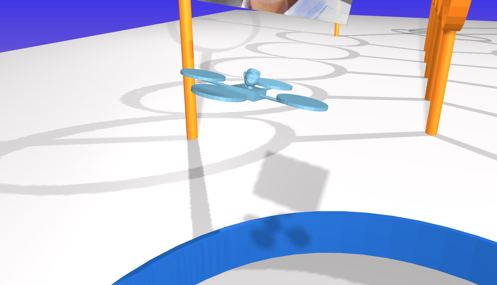

# Design Project 3 (racing drone)
{: .no_toc }

- TOC
{:toc }

## System

The third project that you will complete this semester is to design, implement, and test a controller that enables a quadrotor - aka "the drone" - to race through rings from start to finish without crashing.



In particular, your drone will be racing with other drones. You will need to take care not to run into these other drones, as collisions may cause drones to crash and cat-pilots to be lost.

Keep your cat-pilot safe! Give them victory!


## Context {#drone-context}

Imagine that, working as a control systems engineer, you have been hired by [Tiny Whoop](https://www.tinywhoop.com/) to design a controller for a small-scale drone. In particular, imagine that Tiny Whoop intends to market this drone to amateur cat-pilots for racing (e.g., see their [alley cat coffee cup invitational race](https://youtu.be/jnXgoRxyVqU?t=283)). Your job is to show that this drone — with a suitable controller — is capable of high-speed, agile flight.

As you work on this project, we encourage you to think about other possible applications of drones such as these. [PowderBee](https://snowbrains.com/new-avalanche-rescue-drone-in-the-works/) from [Bluebird Mountain](https://www.springwise.com/innovation/sport-fitness/powderbee-drone-avalanche-rescue/), for example, is intended to find avalanche victims (i.e., people buried under thick snow) quickly so they can be rescued before succumbing to asphyxiation, hypothermia, or other injuries — every second counts in rescue applications, just as for racing drones.


## Model

The motion of each drone is governed by ordinary differential equations with the following form:

$$\begin{bmatrix} \dot{p}_x \\ \dot{p}_y \\ \dot{p}_z \\ \dot{\psi} \\ \dot{\theta} \\ \dot{\phi} \\ \dot{v}_x \\ \dot{v}_y \\ \dot{v}_z \\ \dot{w}_x \\ \dot{w}_y \\ \dot{w}_z \end{bmatrix} = f\left(p_x, p_y, p_z, \psi, \theta, \phi, v_x, v_y, v_z, w_x, w_y, w_z, \tau_x, \tau_y, \tau_z, f_z \right)$$

In these equations:

* $p_x$ is the **$x$ position** (m)
* $p_y$ is the **$y$ position** (m)
* $p_z$ is the **$z$ position** (m)
* $\psi$ is the **yaw angle** (rad)
* $\theta$ is the **pitch angle** (rad)
* $\phi$ is the **roll angle** (rad)
* $v_x$ is the **linear velocity along the body-fixed $x$ axis** (m/s)
* $v_y$ is the **linear velocity along the body-fixed $y$ axis** (m/s)
* $v_z$ is the **linear velocity along the body-fixed $z$ axis** (m/s)
* $w_x$ is the **angular velocity about the body-fixed $x$ axis** (rad/s), which points forward
* $w_y$ is the **angular velocity about the body-fixed $y$ axis** (rad/s), which points left
* $w_z$ is the **angular velocity about the body-fixed $z$ axis** (rad/s), which points up
* $\tau_x$ is the **net torque about the body-fixed $x$ axis** ($N\cdot\text{m}$)
* $\tau_y$ is the **net torque about the body-fixed $y$ axis** ($N\cdot\text{m}$)
* $\tau_z$ is the **net torque about the body-fixed $z$ axis** ($N\cdot\text{m}$)
* $f_z$ is the **net force along the body-fixed $z$ axis** ($N$)

A symbolic description of these equations of motion (DeriveEOM-Template.ipynb) is provided with the project code.

{: .note}
> The body frame attached to the drone has $x$ forward, $y$ **left**, and $z$ **up**. This convention is different from what is commonly used for aircraft (with $y$ right and $z$ down), and in particular is different from what you used in your second design project. A positive yaw angle means the drone rotates **left** (not right, like the aircraft). A positive pitch angle means the drone rotates **down** (not up, like the aircraft).

The actuators that produce the net torques $\tau_x, \tau_y, \tau_z$ and net force $f_z$ are the four rotors on the drone, each of which is driven by an electric motor. These rotors can spin in only one direction, and have minimum and maximum speeds. These bounds limit the torques and forces that can actually be produced. These limits are more complicated than simple minimums and maximums. Here are two ways to get a sense for what these limits are:

* Call the function

  ```python
  (
    tau_x,
    tau_y,
    tau_z,
    f_z,
  ) = simulator.enforce_motor_limits(
    tau_x_cmd,
    tau_y_cmd,
    tau_z_cmd,
    f_z_cmd,
  )
  ```
  to find the torques and forces that would actually be applied for given torque and force commands. Note that this function cannot be called from within your controller code — it can only be called from elsewhere in your notebook, for the purpose of testing.

* Use your data from simulation to plot both the torque and force commands as well as the torques and forces that are actually applied. An example is provided in the template notebook.

Ask if you want more details about the mapping from commanded to actual forces and torques.

Sensors provide a noisy measurement of the position in space of two markers (`pos_markers`), one at the center of the left rotor and one at the center of the right rotor. This is the sort of measurement that would be provided by a standard commercial motion capture system (e.g., [OptiTrak](https://optitrack.com) or [Vicon](https://www.vicon.com)). A [symbolic description of sensor model]({{ site.github.repository_url }}/tree/main/projects/04_drone/DeriveEOM-Template.ipynb) is provided with the [project code]({{ site.github.repository_url }}/tree/main/projects/04_drone).

In addition to these marker position measurements, your controller is also provided with the following information:

* the position (`pos_ring`) of the center of the next ring that the drone needs to pass through
* the vector (`dir_ring`) normal to this next ring (i.e., pointing through its center)
* a flag (`is_last_ring`) that indicates if this next ring is the last ring, a.k.a., the "finish"
* the position (`pos_others`) of all other drones that are still flying.

The code provided simulates the motion of this system (DroneDemo-Template.ipynb) and also derives the dynamic model and sensor model in symbolic form (DeriveEOM-Template.ipynb).

The goal is to race as fast as possible from the start ring to the goal ring, passing through all the rings in between.

## Tasks


First, you must do **all** of the following things:

- Define a requirement and a verification, just as you did in the previous design projects. Ensure the requirement explicitly addresses the drone's ability to successfully navigate through multiple rings along the designated racing path.
- Linearize the equations of motion and a sensor model (the sensor model is straightforward, ask in Canvas if you have questions). Verify that the equilibrium point you picked is indeed an equilibrium point.
- Show that the linearized system is both controllable and observable.
- Design a stable controller and a stable observer with respect to the linearized system.
- Add trajectory tracking to enable movement between rings. This could be something
  as simple as switching the equilibrium point to the latest target ring center. However,
  you could always come up with better ways to do this – gradually changing your target
  point to the center of next target ring is one particular option.
- Implement the controller and observer and test them in simulation.
- Your report must contain a section (in words) about how the controller was designed -- make sure to include all relevant mathematical formulations.


Secondly, do the following things to evaluate your control design:

* Identify and diagnose as many sources of failure as you can find--this has to be included in the results and discussion section of your report. 
* Pick one simulation result and analyze it in detail--this also has to be included in the results and discussion section of your report. The analysis should be detailed, backed by data (and tables/figures if needed).
* Create at least four figures of aggregate results from at least 30 simulations:
  * Show how well your controller is working (e.g., with a histogram of error between actual position and desired position).
  * Show how well your observer is working (e.g., with a histogram of error between estimated position and actual position).
  * Show how fast your drone completes the race (e.g., with a histogram of completion times). You may also want to show how likely it is that your drone completes the race at all, without failure.
  * Show how long it takes your controller to run (e.g., with a histogram of computation times). 

Just as in your previous two design projects, you must be specific about what you mean by "success" and you must provide **quantitative** evidence to support the claim that you have (or have not) succeeded. Remember that people often think about this in terms of **requirements** and **verifications**.

{: .note-title}
> Analysis of failure
>
> In this project, we would like you to focus on identifying and diagnosing failures. In this context, a "failure" is anything that causes your drone not to reach the finish ring. There are many reasons why a particular control design might lead to failure. Your job as a control engineer is to uncover and address these sources of failure. At minimum, you should do the following two things for your final control design:
> 
> * **Identify** as many failures as possible.
> * **Diagnose** each failure, saying why you think it happened and providing evidence to support your claim.
> 
> It is often helpful to put failures into categories — that is, to identify and diagnose *types* of failures, and to use *particular* failures as a way to illustrate each type.
> 
> Remember that you have practice in doing rigorous data collection, analysis, and visualization (the focus of the [second design project](#design-project-2-spacecraft-with-star-tracker)). Rigorous data collection can help a lot in identifying and diagnosing failures.
> 
> You may, of course, be tempted to **eliminate** failures after you find them, by making some change to your control design. This is exactly the right thing to do, but remember that after you make a change, you'll have to repeat (completely) your analysis of failure.

In doing these things, **keep your focus on the safety and well-being of your cat-pilot**. They need to know not only that your control system is reliable, but also what failures are possible and how likely they are to occur.

### Bonus Questions

Once you have a working control design, you can turn your attention to the following additional
analysis for bonus points:

- Designing a controller that can reach the last ring through all the rings – you should
  submit working code for verification and also mention this addition work in the report
  under a title “Bonus Work”.
- The goal in this project is to minimize the time your drone takes to reach the last
  ring.
  <span style="color:red">Please record the timings if the drone is successful in reaching the last state, and include them in your report.</span>
  We will have a (simulated) live drone race on the last day of class! If you want to be included in the race, please (a) submit the deliverables by 04/30/2026, 11:59PM (THIS IS NOT THE PROJECT DEADLINE. THIS IS THE DEADLINE FOR THE RACE APPLICATION.), and (b) fill out the form that we will send out on Canvas.  
- Our leaderboard will have the top 7 fastest drones. The fastest drone will receive 8 bonus points, the second fastest will receive 6 points, the third fastest will receive 5 points, and the remaining entries in the Top 7 will receive 4 points. Any drone that successfully completes the course but does not make the leaderboard will earn 2 bonus points.


### Your deliverables

We will use Canvas for submitting design projects. You must submit the following by **April 26, 11:59PM**:

##### Code

Your code will satisfy the following requirements:

- It **must** be in a folder called code-<net-id> (lower case).
- It **must** include a notebook called `GenerateResults.ipynb` that can reproduce all of the results that you show in the report. (You can work in the SpacecraftDemo-Template.ipynb notebook (or the copy that you created) and then rename it to `GenerateResults.ipynb` when you are ready to submit.)
- It **must** include all the other files (with the right folder structure) that are necessary for `GenerateResults.ipynb` to function.
- It **must not** rely on any dependencies other than those associated with the conda environment.

##### Report

This report will satisfy the following requirements:

- It must be a single PDF document that is called `report.pdf` and that conforms to the guidelines for [Preparation of Papers for AIAA Technical Conferences](https://www.overleaf.com/latex/templates/latex-template-for-the-preparation-of-papers-for-aiaa-technical-conferences/rsssbwthkptn#.WbgUXMiGNPZ). In particular, you **MUST** use the above given LaTeX manuscript template.
- It must say how you addressed all of the required tasks (see above).
- It must tell a story that shows you have found and explored something that interests you. 
- It must acknowledge and cite any sources (including the use of Generative tools).
- It should preferably be about 5 pages in length — it will be hard to show off your work with anything shorter, and it will be hard to keep readers’ attention with anything longer.

You may organize your report however you like. Here is a suggested structure (note that you are free to add or remove sections, as long as you cover all the required tasks):
* It must have a descriptive title that begins with "DP3" (e.g., "DP3: Control of a racing drone").
* It must have a list of author names and affiliations.
* It must contain the following sections:
  * *Abstract.* Summarize your entire report in one short paragraph.
  * *Nomenclature.* List all symbols used in your report, with units.
  * *Introduction.* Prepare the reader to understand the rest of your report and how it fits within a broader context.
  * *Theory.* Derive a model and do control design.
  * *Experimental methods.* Describe the experiments you performed in simulation in enough detail that they could be understood and repeated by a colleague.
  * *Results and discussion.* Show the results of your experiments in simulation (e.g., with plots and tables) and discuss the extent to which they validate your control design and support an argument for the safety of your racing system.
  * *Conclusion.* Summarize key conclusions and identify ways that others could improve or build upon your work.
  * *Appendix.* Provide a review of your racing system from the perspective of one or more of your cat-pilots. They are important stakeholders. You are welcome to refer to this appendix — i.e., to the remarks from your cat-pilots — in other parts of your report, if it is helpful in supporting your arguments.
  * *Acknowledgements.* Thank anyone with whom you discussed this project and clearly describe what you are thanking them for.
  * *References.* Cite any sources, including the work of your colleagues.

#### Video
Video is automatically generated when you run the code and you should see a file named `video.mp4` in the same folder as your code. This video shows a simulation of your controller in action. Please submit this video file (make sure the video corresponds to the final controller you are creating). You can also create a video of your results using other tools if you prefer, but the video generated by the code is sufficient for this project. Do not try and edit the videos.

#### Submission Instructions

To make it easier logistically, there will be **three** assigned submissions for this project on Canvas. Please submit the following separately:

1. Report: Submit a pdf version of your report.
2. Video: Every time you run your code, you will see that it also creates a `video.mp4`, which shows a simulation of your controller in action. Please submit this video file (make sure the video corresponds to the final controller you are creating).
3. Code: Compress your code into a zip file and submit the zip file named code-<net-id>.zip


## Deliverables for drone race


### Contest entry (by April 30, 11:59PM) {#contest-code}

* It must not raise an exception (i.e., throw an error).
* It must not print anything to `stdout` (i.e., run `print` statements).
* It must not exceed limits on computation time (5 seconds for module load, 1 second for `__init__`, 1 second for `reset`, and `1e-2` seconds for `run`).

More details on this will be provided on Canvas so that everyone notices it.


### Evaluation

Your work will be evaluated based on:

- (60%) Completion of the requirements and the resulting description of the results
- (20%) Submission of working code
- (5%) Your demonstration video
- (15%) Your report being formatted correctly

Late submission will be penalized (by up to 25% for the first week of delay—**prorated** for the actual amount of delay—and 50% after then), but extraordinary efforts may receive extra commendation. 

#### Rubric

[DP3 Rubric (SP26)](../assets/DP3_rubric_SP26.pdf)